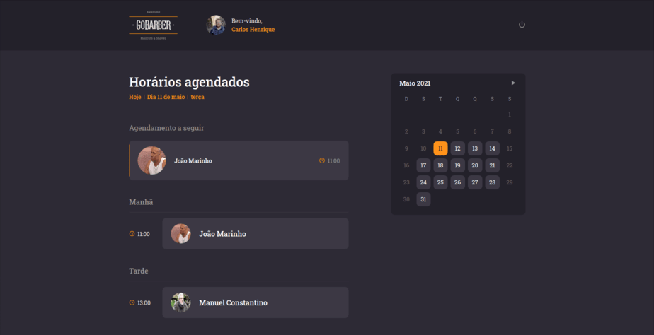
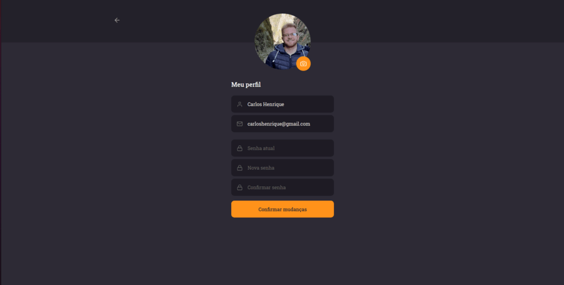
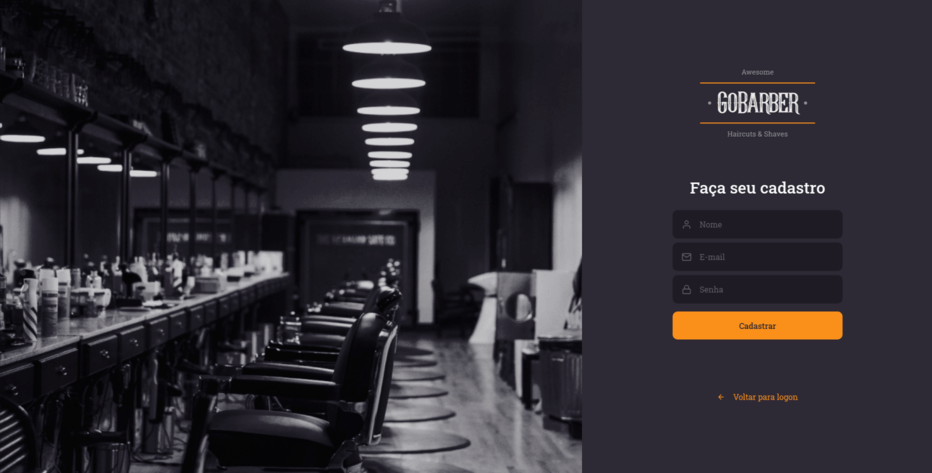

# GoBarber - Web

Versão web da aplicação para agendamentos em barbearia.

# Layout

<table>
    <tr>
        <td>
            
        </td>
        <td>
            
        </td>
    </tr>
    <tr>
        <td>
            
        </td>
        <td>
            
        </td>
    </tr>
</table>

# Funcionalidades

- Criação do usuário
- Login
- Reset da senha
- Agendamentos do profissional

# Tecnologias

- TypeScript
- Axios
- Jest
- Styled Components
- Unform
- Yup
